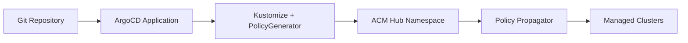
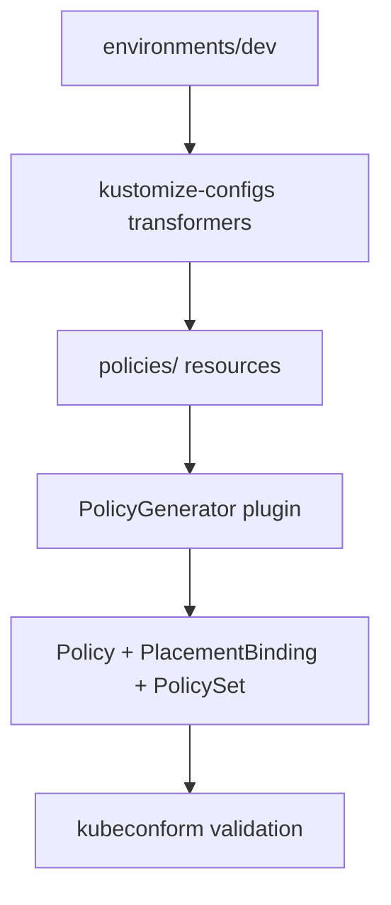

# Architecture

## Design principles

1. **PolicyGenerator-first** — Kubernetes manifests are source of truth; OCM `Policy` CRs are generated
2. **GitOps via ArgoCD** — no ACM Application Lifecycle (Subscription/Channel)
3. **Environment overlays** — same policies, different namespaces/ClusterSets per fleet stage
4. **Reusable placements** — avoid 1:1 placement-to-policy coupling
5. **AI-readable** — consistent structure, README per policy, machine-parseable metadata

## Data flow

## Build pipeline

## Directory responsibilities

| Path | Role |
|------|------|
| `policies/` | PolicyGenerator source projects grouped by domain |
| `policies/policy-catalog.yaml` | Machine-readable policy index (custom schema, not a K8s CRD) |
| `environments/` | Per-fleet kustomize overlay (namespace, ClusterSet, suffix) |
| `kustomize-configs/` | Shared kustomize Component (ClusterSet refs, PolicySet naming) |
| `local-cluster/` | Hub ManagedCluster patches (prod only) |
| `argocd/` | ArgoCD Application definitions |
| `template-examples/` | Reusable patterns not tied to a full policy |
| `tutorial/` | Step-by-step learning modules |

## Consolidation sources

| Source | Migrated to | Notes |
|--------|-------------|-------|
| policy-collection `policygenerator/policy-sets/` | `policies/policy-sets/` | PolicyGenerator PolicySets |
| policy-collection raw YAML | Removed | Use PolicyGenerator under `policies/` instead |
| bry-acm-policy-samples `policies/` | `policies/` | Primary policy library |
| bry-acm-policy-samples `environments/` | `environments/` | Environment model |
| bry-acm-policy-samples `template-examples/` | `template-examples/` | Template patterns |

## What was removed

- `legacy/` raw Policy YAML — consolidated into PolicyGenerator projects
- `deploy/subscription.yaml`, `deploy/deploy.sh` — appsub GitOps
- `policygenerator/` duplicate content — moved under `policies/`
- ARO-specific and third-party samples not carried forward (e.g. `zts-xcrypt`)

## Namespace strategy

- Generator default: `acm-policies` (placeholder)
- Environment overlay sets actual namespace: `acm-policies-dev`, `acm-policies-prod`, etc.
- `namespace-namereference.yml` rewrites policy dependency namespaces

## PolicySet strategy

Large bundles (openshift-plus, gatekeeper sets) live in `policies/policy-sets/` and are **opt-in**. They are validated by `./build/validate-policies.sh` but not included in the default `policies/kustomization.yaml` environment build.
