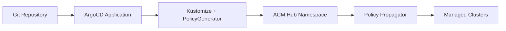
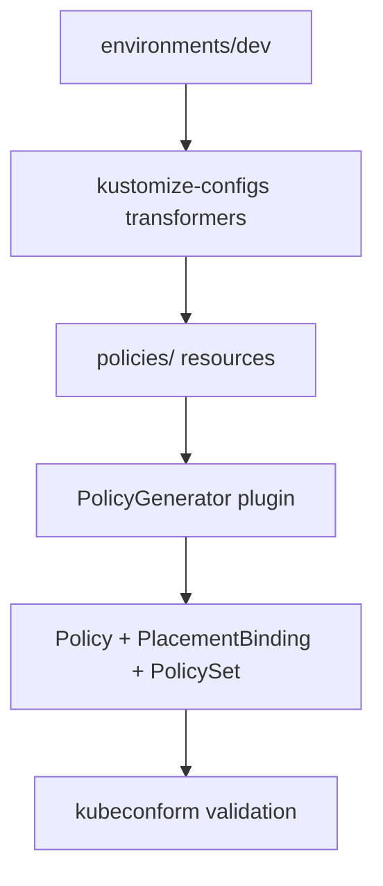
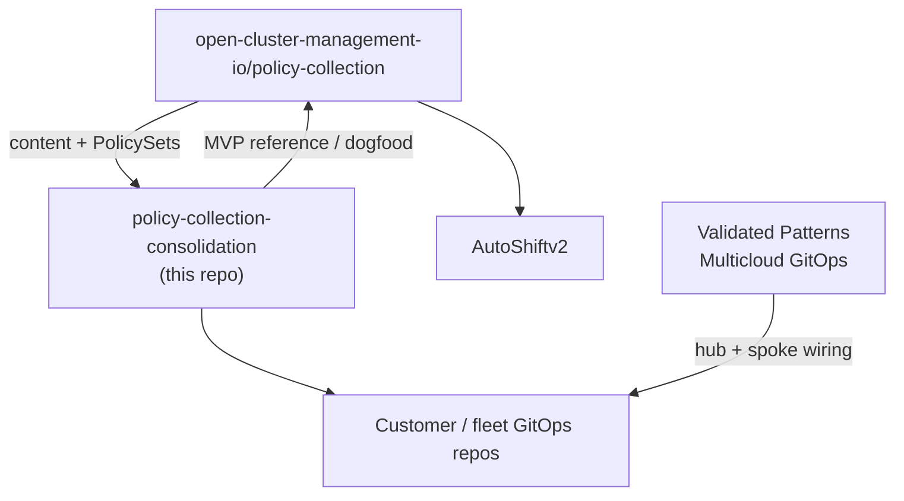

# Architecture

## Design principles

1. **PolicyGenerator-first** — Kubernetes manifests are source of truth; OCM `Policy` CRs are generated
2. **GitOps via ArgoCD** — no ACM Application Lifecycle (Subscription/Channel)
3. **Environment overlays** — same policies, different namespaces/ClusterSets per fleet stage
4. **Reusable placements** — avoid 1:1 placement-to-policy coupling
5. **AI-readable** — consistent structure, README per policy, machine-parseable metadata

## Data flow

## Build pipeline

## Directory responsibilities

| Path | Role |
|------|------|
| `policies/` | PolicyGenerator source projects grouped by domain |
| `policies/policy-catalog.yaml` | Machine-readable policy index (custom schema, not a K8s CRD) |
| `environments/` | Per-fleet kustomize overlay (namespace, ClusterSet, suffix) |
| `kustomize-configs/` | Shared kustomize Component (ClusterSet refs, PolicySet naming) |
| `local-cluster/` | Hub ManagedCluster patches (prod only) |
| `argocd/` | ArgoCD Application definitions |
| `template-examples/` | Reusable patterns not tied to a full policy |
| `tutorial/` | Step-by-step learning modules |

## Consolidation sources

| Source | Migrated to | Notes |
|--------|-------------|-------|
| policy-collection `policygenerator/policy-sets/` | `policies/policy-sets/` | PolicyGenerator PolicySets |
| policy-collection raw YAML | Removed | Use PolicyGenerator under `policies/` instead |
| bry-acm-policy-samples `policies/` | `policies/` | Primary policy library |
| bry-acm-policy-samples `environments/` | `environments/` | Environment model |
| bry-acm-policy-samples `template-examples/` | `template-examples/` | Template patterns |

- Generator default: `acm-policies` (placeholder)
- Environment overlay sets actual namespace: `acm-policies-dev`, `acm-policies-prod`, etc.
- `namespace-namereference.yml` rewrites policy dependency namespaces

## PolicySet strategy

Large bundles (openshift-plus, gatekeeper sets) live in `policies/policy-sets/` and are **opt-in**. They are validated by `./build/validate-policies.sh` but not included in the default `policies/kustomization.yaml` environment build.

## Ecosystem fit

This repository is **governance content** — policy manifests, PolicyGenerator projects, and environment overlays. It sits in a larger multicluster GitOps stack alongside fleet frameworks and reference architectures.

| Artifact | Role |
|----------|------|
| [policy-collection](https://github.com/open-cluster-management-io/policy-collection) | Upstream canonical policy examples and PolicySets |
| **policy-collection-consolidation** (this repo) | Reference implementation: PolicyGenerator-only, ArgoCD deploy, environment overlays, machine-readable catalog |
| [AutoShiftv2](https://github.com/auto-shift/autoshiftv2) | Production fleet framework that **uses ACM Policies heavily** for day-2 OpenShift Platform Plus; consumes curated policy tiers (`stable/`, `community/`, `certified/`) aligned with policy-collection |
| [Multicloud GitOps](https://validatedpatterns.io/patterns/multicloud-gitops/) | Validated Pattern for hub-and-spoke GitOps with RHACM governance on managed clusters — defines **how** fleets are wired, not which policies to ship |

### AutoShift

[AutoShiftv2](https://github.com/auto-shift/autoshiftv2) is an opinionated IaC framework for post-install OpenShift management using **ACM and OpenShift GitOps**. GitOps on the hub declaratively manages ACM; ACM distributes configuration and compliance to managed clusters. AutoShift is a primary **downstream consumer** of policy-collection-style content: feature toggles, dry-run rollout, and versioned ClusterSets mirror patterns in this repo’s `environments/` overlays.

Proven changes here (PolicyGenerator layout, Placement API, ArgoCD-only delivery) are candidates for upstream policy-collection PRs that AutoShift and similar frameworks can vendor without translation layers.

