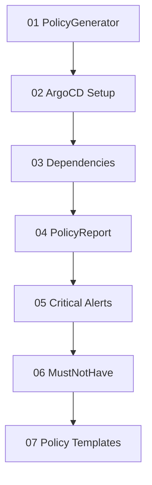

# ACM Policy Tutorial

Hands-on walkthrough of ACM governance patterns used in this repository. Inspired by [ch-stark/gatekeeper-examples](https://github.com/ch-stark/gatekeeper-examples).

## What you will learn

| Module | Topic | Key concepts |
|--------|-------|--------------|
| [01-policy-generator](01-policy-generator/) | PolicyGenerator basics | `generator.yml`, kustomize, generated `Policy` CRs |
| [02-argocd-setup](02-argocd-setup/) | ArgoCD + PolicyGenerator | `kustomizeBuildOptions`, repo-server plugin, `Application` |
| [03-policy-dependencies](03-policy-dependencies/) | Policy dependencies | Ordered rollout, `dependencies` + `compliance: Compliant` |
| [04-policy-report](04-policy-report/) | PolicyReport monitoring | `wgpolicyk8s.io` reports, Kyverno/Gatekeeper violations |
| [05-critical-policy-alerts](05-critical-policy-alerts/) | Alerts for critical policies | `PrometheusRule`, `policy_governance_info` metric |
| [06-mustnothave](06-mustnothave/) | MustNotHave compliance | Detect unwanted cluster state (failed OLM, etc.) |
| [07-policy-templates](07-policy-templates/) | Policy templates | `fromClusterClaim`, `{{hub ... hub}}`, per-cluster values |

## Prerequisites

- ACM 2.15+ hub with governance enabled
- `kubectl` / `oc` access to the hub
- PolicyGenerator plugin for local builds:

```bash
go install open-cluster-management.io/policy-generator-plugin/cmd/PolicyGenerator@latest
export KUSTOMIZE_PLUGIN_HOME=$(go env GOPATH)/bin
```

## Build the full tutorial locally

```bash
cd tutorial
kustomize build --enable-alpha-plugins
```

## Deploy to a hub (manual)

1. Create namespace and placement prerequisites (see `placements/`)
2. Apply generated policies:

```bash
kustomize build --enable-alpha-plugins | kubectl apply -f -
```

3. For ArgoCD-driven sync, apply `02-argocd-setup/argocd-application.yml` after configuring your git path to this `tutorial/` directory.

## Learning path



Start with **01** if you are new to PolicyGenerator. Each module has its own `README.md` with explanations and verification commands.

## Namespace

Tutorial policies deploy to `tutorial-policies` by default. Override in `generator.yml` `policyDefaults.namespace` if needed.

## Related examples in this repo

- `policies/operators/gitops/` — production ArgoCD + PolicyGenerator wiring
- `policies/acm-configs/policy-alerts/` — PrometheusRule for non-compliant policies
- `policies/cluster-validations/` — MustNotHave OLM health checks
- `template-examples/` — advanced PolicyGenerator templates and patterns
